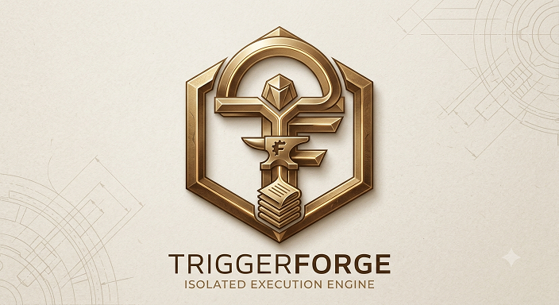

<p align="center">
  
</p>

<p align="center">
  <strong><a href="docs/index.md">📖 查看详细文档 (Full Documentation)</a></strong>
</p>

```markdown
---

## 🛠️ 简体中文 (Chinese)

# 🛠️ TriggerForge (v1.1-PRO)

> **一个事件驱动的目录编排引擎，具备健壮的子进程沙箱、配置即代码 (Configuration-as-Code) 以及弹性的故障隔离能力。**

TriggerForge 是一个现代化的、生产就绪的守护进程，专为监控文件夹、编排复杂的文件处理流水线以及在高度隔离的子进程中执行自定义插件而设计。

---

## 🛠️ 开发设置

为了确保开发环境的一致性和测试套件的稳定性，请遵循以下步骤：

### 1. 环境准备
TriggerForge 使用 `src/` 布局来组织源代码。为了确保测试能正确识别模块路径，请始终从项目根目录通过 `python -m` 运行 `pytest`。

```bash
# 1. 创建并激活虚拟环境 (Windows PowerShell)
python.exe -m pip install --upgrade pip
python -m pip install --user pipx
python -m pipx ensurepath
pipx install hatch
hatch env create
hatch shell

```

### 2. 运行测试

我们的测试套件包含一个自动模块导入路径注入机制，以确保其在不同开发环境下运行的一致性。

```bash
# 从项目根目录运行所有测试
python -m pytest -s

```

## 🤝 贡献与合规 (Contributing)

我们非常欢迎社区贡献！为了确保项目的合规性，请遵循以下流程：

* **签署协议**：首次提交 PR 时，请根据 [CLA Assistant](https://cla-assistant.io/) 的提示签署贡献者许可协议 (CLA)。
* **开发规范**：提交代码前，请务必确保所有测试通过 `python -m pytest`。
* **更多指南**：详细的参与流程请查阅 [docs/zh/CONTRIBUTING.md](https://github.com/zybcode/TriggerForge/blob/master/docs/legal/CONTRIBUTING.md)。

## 📜 协议 (License)

本项目采用 [GPLv3 License](https://github.com/zybcode/TriggerForge/blob/master/LICENSE) 进行开源。

---

## 🇬🇧 English Version

# 🛠️ TriggerForge (v1.1-PRO)

> **An event-driven directory orchestration engine with robust subprocess sandboxing, configuration-as-code, and resilient fault isolation.**

TriggerForge is a modern, production-ready daemon designed to watch folders, orchestrate complex file-processing pipelines, and execute custom plugins inside highly isolated subprocesses.

---

## 🛠️ Development Setup

To ensure consistency in your development environment and stability in your test suite, please follow these steps:

### 1. Environment Preparation

TriggerForge uses a `src/` layout to keep the source code organized. To ensure that tests can correctly identify module paths, please always run `pytest` via `python -m` from the project root directory.

```bash
# 1. Create and activate a virtual environment (Windows PowerShell)
python.exe -m pip install --upgrade pip
python -m pip install --user pipx
python -m pipx ensurepath
pipx install hatch
hatch env create
hatch shell

```

### 2. Running Tests

We prioritize both functionality and test stability. Our test suite includes an automatic module import path injection mechanism to ensure it runs consistently across different development environments.

```bash
# Run all tests from the project root directory
python -m pytest -s

```

## 🤝 Contributing

We welcome contributions! To ensure project compliance, please follow these steps:

* **Sign CLA**: Upon your first pull request, please sign the Contributor License Agreement (CLA) as prompted by the [CLA Assistant](https://cla-assistant.io/).
* **Coding Standards**: Ensure all tests pass via `python -m pytest` before submitting a PR.
* **Detailed Guide**: See [docs/en/CONTRIBUTING.md](https://github.com/zybcode/TriggerForge/blob/master/docs/legal/CONTRIBUTING.md) for full details.

## 📜 License 

This project is licensed under the [GPLv3 License](https://github.com/zybcode/TriggerForge/blob/master/LICENSE).

```
